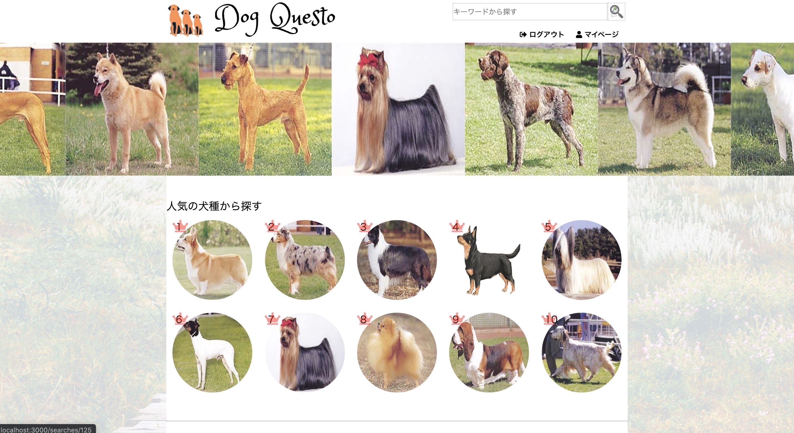
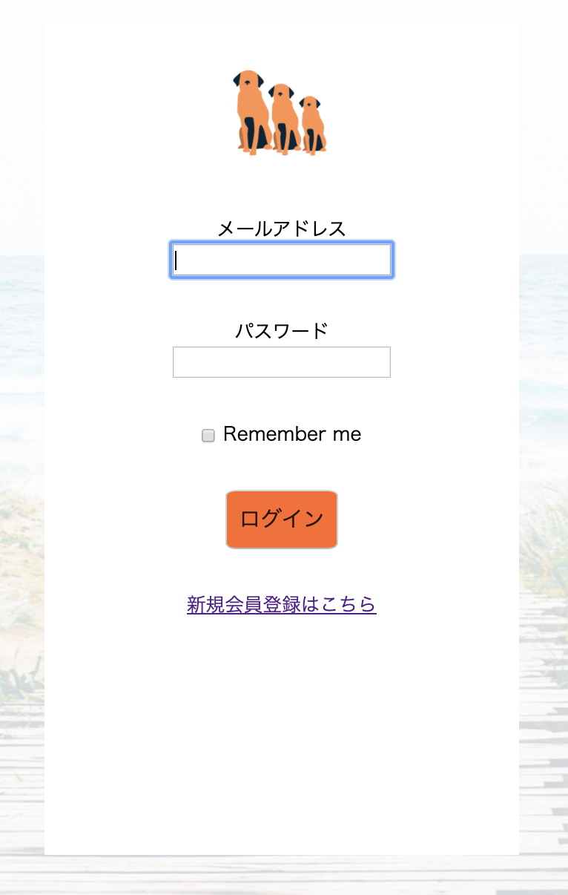

# README
## 【Dog Questo】取扱説明書

## 本番環境URL
* http://54.178.203.223/

## テストアカウント
* メールアドレス　test@test
* パスワード　111111

## 制作経緯
犬を飼いたい！となってネットで検索するも、ショップのサイトでは子犬の紹介ばかり。   

* 成犬をしっかりイメージできているのだろうか？
* 思ったより大きくなってこんなはずじゃなかったとならないだろか？
* 人気の犬種にだけ目が行きがちだが、こんな子もいるのに…  

「子犬ベースではなく、成犬ベースで犬を探せればいい」「実際に飼っている人と繋がり、情報共有をしたい」  
と考え、本アプリを作成致しました。

## 開発環境
* Haml & Sass
* JavaScript
* JQuery
* Ruby
* Ruby on Rails
* mySQL
* AWS
* GitHub
* Visual Studio Code

## 実装内容
* ユーザー登録機能
* ペット登録機能
* マイページ機能
* 記事投稿、編集、削除機能
* チャット機能
* パンくず機能
* カテゴリー機能
* お気に入り機能

#### メインページ

登録データからランダムに画像と取り出し、画像が流れる様になっています。  
ユーザーのお気に入り機能からランキングを作成し、自動で人気順位が表示されます。  
ユーザーの投稿を新着順で5つ表示させております。  
gemファイル「ancestry」を用いてカテゴリー機能を実装しております。  

#### ユーザー登録機能
</img>
</img>
gemファイル「devise」を導入しユーザーネーム、メールアドレス、パスワードにてユーザー登録が可能です。
今後、googleアカウントを利用してのログイン機能を実装する予定です。
#### ペット登録機能
#### マイページ機能

#### 記事投稿、編集、削除機能
#### チャット機能

#### パンくず機能

#### カテゴリー機能

#### お気に入り機能

## 今後の実装予定

This README would normally document whatever steps are necessary to get the
application up and running.

Things you may want to cover:

* Ruby version

* System dependencies

* Configuration

* Database creation

* Database initialization

* How to run the test suite

* Services (job queues, cache servers, search engines, etc.)

* Deployment instructions

* ...
